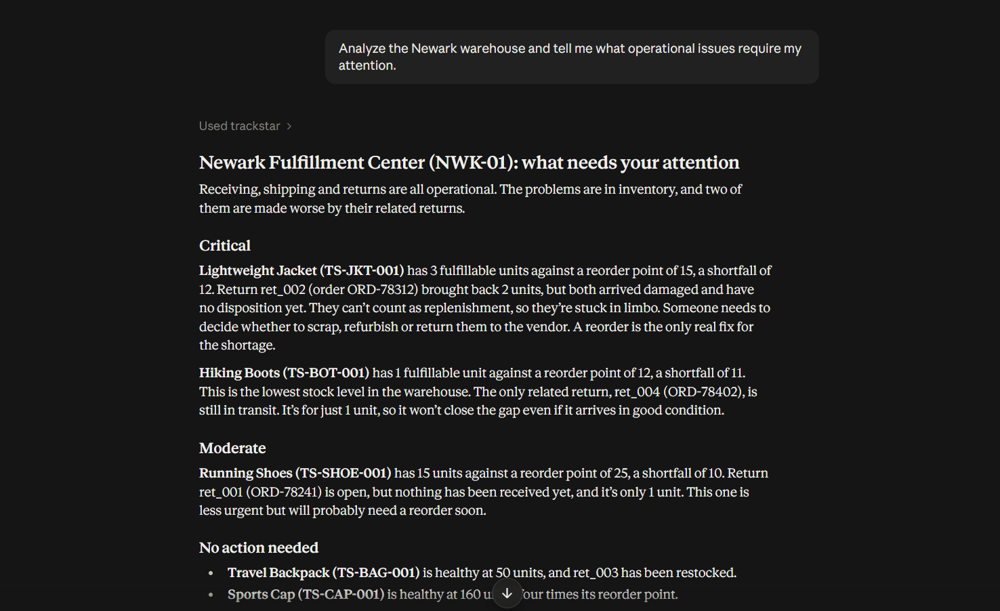
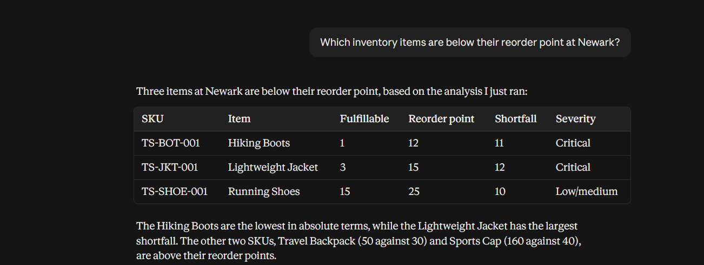
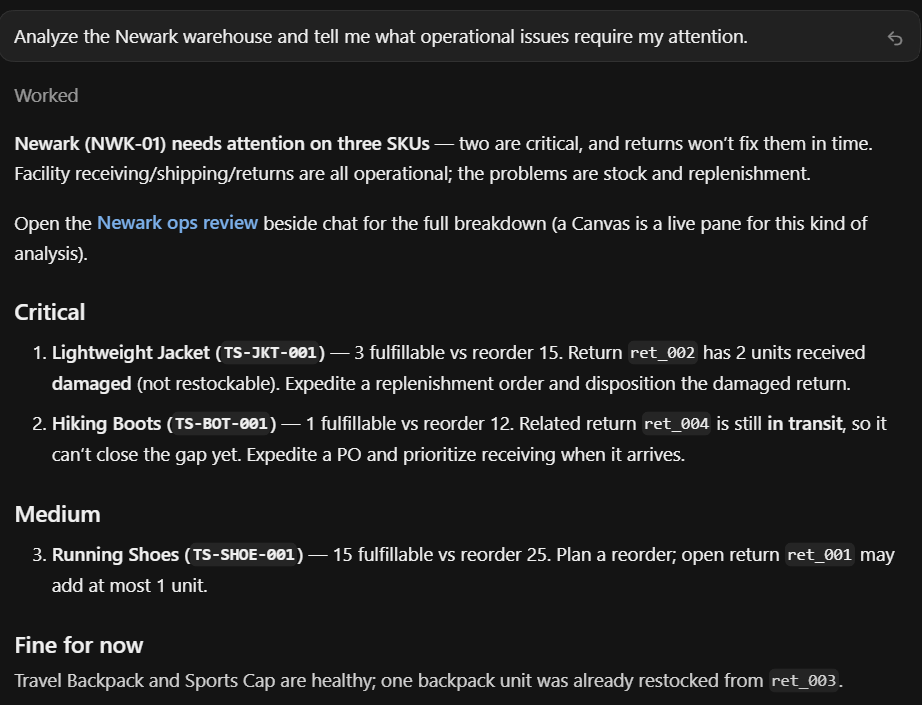

# Trackstar Warehouse Operations MCP

An MCP server for AI-assisted warehouse operations analysis, built around Trackstar's normalized supply-chain data model.

## Overview

Trackstar provides a unified API for connecting software applications to supply-chain systems such as warehouse management systems (WMS), carts, and carriers. Its platform abstracts integration differences and provides a normalized data model that applications can use consistently.

This project explores a complementary problem:

**How can an AI assistant reason over normalized warehouse data and identify operational issues that require human attention?**

Trackstar Warehouse Operations MCP is an independent implementation of the Model Context Protocol (MCP) that exposes warehouse, inventory, and return information to AI hosts. It combines focused data-retrieval tools with a higher-level operational analysis tool that examines relationships between inventory conditions and related returns.

Rather than simply returning records, the server helps an AI assistant explain why a particular inventory situation matters, whether related returns can contribute to replenishment, and which findings deserve attention.

**Project status:** Working prototype using mock operational data. The server does not connect to Trackstar's production API and is not an official Trackstar integration.

## The Company: Trackstar

Trackstar is a supply-chain connectivity platform designed to simplify integrations between software applications and fragmented warehouse and logistics systems.

Different systems may expose different APIs, data structures, authentication mechanisms, pagination behavior, and operational conventions. Trackstar provides an integration layer that abstracts these differences and exposes normalized data to applications.

This project builds on that normalized-data concept. It focuses on the layer above data connectivity: making operational data accessible to AI assistants through an MCP interface.

## The Problem

Warehouse operations involve several related types of information:

- Inventory quantities and availability
- Committed and fulfillable inventory
- Reorder thresholds
- Customer returns and their statuses
- Returned quantities and receiving conditions
- Restocking information

Examining these records independently may not provide enough context to make an informed operational decision.

Consider an inventory item that is below its reorder point and has a related customer return. The existence of that return does not necessarily mean that usable inventory will become available.

- A return that is still in transit cannot currently be counted as replenishment.
- Returned units received in damaged condition should not automatically be treated as usable inventory.
- Units that have been received and restocked can contribute to replenishment.

These distinctions affect how an inventory shortfall should be interpreted.

The problem this MCP addresses is:

**How can an AI assistant investigate related warehouse records and produce evidence-based findings instead of simply listing inventory and returns separately?**

A representative query is:

> Analyze the Newark warehouse and tell me what operational issues require my attention.

The server supports this workflow by identifying low-stock inventory, examining related returns, evaluating their relationships, and producing structured operational findings.

## Intended Users

The intended users are companies and operations professionals working with warehouse data through systems connected through Trackstar.

A typical interaction follows this flow:

```text
  Warehouse / Operations User
               │
               │  Natural-language question
               ▼
            AI Host
      Claude Desktop / Cursor
               │
               │  Model Context Protocol
               ▼
  Trackstar Warehouse Operations MCP
               │
               ▼
   Warehouse, Inventory and Return Data
```

The AI assistant acts as an investigation interface over operational data. The MCP supplies the relevant records and analysis, while the human operator remains responsible for deciding what action to take.

The current implementation is read-only. It does not approve purchases, modify inventory, change return statuses, or execute warehouse operations.

## What This MCP Adds

Trackstar addresses the challenge of connecting fragmented supply-chain systems and normalizing their data. This project focuses on making normalized operational data accessible through an AI-native interface.

```text
  Fragmented Supply-Chain Systems
                 │
                 ▼
             Trackstar
      Connectivity + Normalization
                 │
                 ▼
        Normalized Operational Data
                 │
                 ▼
    Trackstar Warehouse Operations MCP
         AI-native investigation
                 │
                 ▼
             AI Assistant
```

The distinction is important: this prototype does not reproduce Trackstar's integration infrastructure or connect to its production API. It demonstrates how an MCP server can operate over a normalized warehouse data model.

## Main Use Case: Warehouse Operations Intelligence

The primary capability is to analyze a warehouse and identify findings that may require human attention.

For example:

> Analyze the Newark warehouse and tell me what operational issues require my attention.

The analysis considers inventory levels, reorder thresholds, return statuses, receiving details, and relationships between inventory items and returns.

```text
Warehouse
├── Inventory
│   ├── Fulfillable quantity
│   ├── Reorder point
│   └── Inventory severity
└── Returns
    ├── Return status
    ├── Associated inventory
    ├── Receiving condition
    └── Restocking information
```

The key capability is cross-entity reasoning. A low-stock finding becomes more informative when the assistant can determine whether a related return is still in transit, contains damaged units, or has already been restocked.

The resulting analysis prioritizes operational findings and explains the evidence supporting them.

## Architecture

The project uses a layered architecture that separates the MCP interface, domain logic, and data access.

```text
                    AI Host
               Claude / Cursor
                       │
                       │  MCP
                       ▼
              ┌──────────────────┐
              │    server.py     │
              │   MCP Interface  │
              └──────────────────┘
                       │
                       ▼
              ┌──────────────────┐
              │ WarehouseService │
              │  Business Logic  │
              └──────────────────┘
                       │
                       ▼
              ┌──────────────────┐
              │  MockRepository  │
              │    Data Access   │
              └──────────────────┘
                       │
                       ▼
                 Mock JSON Data
```

### MCP Server

`server.py` exposes the tools, resource, and prompt to the connected AI host.

### Service Layer

`warehouse_service.py` contains the operational business logic, including inventory severity, return analysis, inventory-return relationships, and the generation of operational findings.

### Repository Layer

`mock_repository.py` handles data access and loads the warehouse, inventory, and return records from JSON files.

### Mock Data

The JSON files provide a deterministic dataset for development, testing, and demonstration without requiring live API credentials.

Separating these responsibilities keeps data access independent of operational reasoning and provides a clear path for replacing the mock repository with a production data source.

## MCP Tools

The server exposes five focused tools. Each has a specific purpose and descriptions that guide the AI host on when to use it.

### `list_warehouses`

Lists the warehouses available for investigation.

**Purpose:** Helps the assistant discover available warehouse identifiers before investigating a particular warehouse.

This tool lists warehouse records but does not analyze inventory, returns, or operational issues.

### `get_warehouse`

Retrieves detailed information about a specific warehouse.

**Purpose:** Answers questions about the warehouse itself, such as its identity, location, contact information, capabilities, timezone, or operational status.

This tool retrieves warehouse metadata only and does not perform operational analysis.

### `find_low_stock_inventory`

Finds inventory items whose fulfillable quantity is below their prototype-defined reorder point.

**Purpose:** Answers focused inventory questions, such as:

> Which inventory items are below their reorder point at Newark?

Example:

```text
Product: Hiking Boots
Fulfillable quantity: 1
Reorder point: 12
Shortfall: 11
Severity: Critical
```

The tool evaluates inventory levels without analyzing related returns. For a broader investigation involving inventory-return relationships, the assistant should use `analyze_warehouse`.

### `get_pending_returns`

Finds returns that are currently pending for a specific warehouse.

The prototype treats returns with the following statuses as pending:

- `open`
- `in-transit`
- `receiving`

**Purpose:** Answers focused questions, such as:

> What pending returns are currently associated with Newark?

This tool reports pending returns but does not determine whether they can contribute to inventory replenishment.

### `analyze_warehouse`

Provides an overall operational assessment of a warehouse and identifies findings that may require human attention.

This is the primary intelligence tool.

The analysis considers:

- Inventory levels relative to reorder points
- Inventory severity and shortfalls
- Pending and completed returns
- Relationships between inventory and related returns
- Whether related returns are replenishing, pending, or not currently contributing to replenishment

**Purpose:** Answers broader investigation questions, such as:

> Analyze the Newark warehouse and tell me what operational issues require my attention.

The tool returns a structured analysis containing warehouse information, inventory analysis, return analysis, inventory-return relationships, and operational findings.

It is read-only and does not assume that an operational action has been approved or performed.

## MCP Resource

### `trackstar://warehouse-model`

The server exposes a resource describing the operational data model used by the MCP.

The resource documents:

- Warehouse, inventory, and return entities
- Relationships between warehouses and inventory
- Relationships between returns and their associated inventory
- Relevant inventory and return fields
- Pending return statuses
- Receiving details, including quantity, condition, and disposition
- The classifications used to describe inventory-return relationships

It also explicitly identifies `reorder_point` and `target_stock_level` as prototype-defined analytical fields rather than Trackstar API fields.

The resource gives the AI host reusable domain context without requiring the entire operational dataset to be embedded in every prompt.

## MCP Prompt

### `warehouse_operations_review`

The server exposes a reusable prompt for warehouse operational reviews.

The prompt directs the AI assistant to:

- Review the warehouse's operational state
- Focus on low and critically low inventory
- Examine pending and damaged returns
- Identify returns that have been restocked
- Analyze relationships between inventory conditions and related returns
- Prioritize findings by operational significance
- Explain why each important finding matters
- Support conclusions using available evidence
- Avoid conclusions that are not supported by the data
- Keep the human operator in the decision loop

This provides a consistent starting point for an operational investigation while allowing the host to formulate the final response.

## Example End-to-End Investigation

Consider the fictional warehouse:

```text
Warehouse: Newark Fulfillment Center
Warehouse ID: wh_001
Warehouse Code: NWK-01
```

An operator asks:

> Analyze the Newark warehouse and tell me what operational issues require my attention.

The MCP examines the inventory records and related returns, then produces structured findings.

### Lightweight Jacket

```text
Fulfillable quantity: 3
Reorder point: 15
Shortfall: 12
Severity: Critical
```

A related return contains two units received in damaged condition. Those units are not currently treated as replenishing inventory.

The finding therefore connects the critical inventory shortfall with the condition of the related return.

### Hiking Boots

```text
Fulfillable quantity: 1
Reorder point: 12
Shortfall: 11
Severity: Critical
```

A related return is still in transit. It cannot currently be counted as replenishment.

The assistant can distinguish the existing inventory shortfall from the potential future arrival of returned units.

### Running Shoes

```text
Fulfillable quantity: 15
Reorder point: 25
Shortfall: 10
Severity: Low
```

A related return remains open and has not been received and restocked. It therefore does not currently resolve the inventory shortfall.

### Why these relationships matter

The assistant can prioritize these findings and explain why each related return does or does not currently contribute to replenishment.

The result is an operational investigation rather than a collection of unrelated inventory and return records. Any recommended action remains a decision for the human operator.

## Why This Is More Than an API Wrapper

A basic MCP could expose separate operations to retrieve warehouse, inventory, and return records, leaving the AI host to perform all cross-entity reasoning.

This project adds a domain-analysis layer.

For example, the raw records may indicate:

```text
Inventory:
  fulfillable = 3
  reorder_point = 15

Related return:
  status = receiving
  condition = damaged
```

The operational analysis connects these records to explain that the inventory is critically below its reorder point and that the related return is not currently contributing to replenishment because the returned units were received damaged.

The distinction is between **retrieving operational data** and **interpreting related operational records**.

The higher-level analysis tool is designed around the latter.

## Host Compatibility and Testing

The MCP server was tested with Claude Desktop and Cursor. Both hosts connected to the same server without requiring changes to the MCP implementation.

### Claude Desktop

Claude Desktop was used for natural-language operational investigations.

The warehouse analysis query produced an operational summary based on the structured findings returned by the MCP. Focused inventory and return queries were also tested to verify that the host could select the appropriate tools.





### Cursor

Cursor was used as the second MCP host.

It successfully connected to the server and exposed the same tools, resource, and prompt. The overall warehouse investigation was tested, and the returned structured analysis was useful for examining how a developer-oriented host interacts with the server.

The hosts served different purposes during validation:

| Host | Role in Validation |
|---|---|
| Claude Desktop | Natural-language operational investigation |
| Cursor | MCP integration and structured-result inspection |



## Tool Description Design

Tool descriptions explicitly define when a tool should be used and clarify what it does not do.

For example, `find_low_stock_inventory` is intended for focused inventory questions and does not analyze related returns. Similarly, `get_pending_returns` retrieves pending return records without deciding whether those returns can contribute to replenishment.

The higher-level `analyze_warehouse` tool is intended for broader operational investigations.

These distinctions help AI hosts select tools based on the user's intent instead of treating every tool as an interchangeable data-retrieval operation. Clear descriptions are particularly important when working with models that may be less reliable at tool selection.

## Human-in-the-Loop Design

The current implementation is intentionally read-only.

It can identify findings such as:

- Critical inventory shortfalls
- Pending returns
- Damaged returned inventory
- Returns that have not yet contributed to replenishment
- Relationships that affect the interpretation of inventory conditions

It does not:

- Create purchase orders
- Modify inventory
- Change return statuses
- Approve operational actions
- Execute inventory transfers
- Contact suppliers
- Automatically resolve operational issues

The assistant provides evidence and context for decision-making. The human operator remains responsible for deciding which action to take.

## Transport and Deployment

### Local Development: stdio

The current implementation is configured for local MCP hosts using standard input/output (stdio).

This is appropriate for local development, MCP Inspector, Claude Desktop, and Cursor. The host launches the MCP server as a local process.

### Shared Deployment: Streamable HTTP

For a shared organizational deployment, the server could instead be exposed through Streamable HTTP.

A possible architecture is:

```text
        AI Host
           │
           │  Streamable HTTP
           ▼
        MCP Server
           │
           ▼
        Service Layer
           │
           ▼
  Trackstar-backed Repository
           │
           ▼
        Trackstar API
```

A shared deployment would require appropriate authentication, authorization, secure secret management, logging, and tenant isolation.

The current prototype does not implement these production concerns because its scope is to demonstrate the MCP interface, operational analysis, and host compatibility.

## Mock Data and Production Boundary

The server currently uses deterministic JSON files:

```text
data/
├── warehouse.json
├── inventory.json
└── returns.json
```

The data allows the project to demonstrate the investigation workflow without a live Trackstar account or production credentials.

The data is modeled around normalized warehouse, inventory, and return concepts. Some fields are prototype-specific, particularly:

- `reorder_point`
- `target_stock_level`

These fields support the project's operational analysis and are not represented as Trackstar API fields.

The current implementation should therefore be understood as an independent MCP prototype built around a Trackstar-inspired normalized data model and a mock operational dataset.

It does not currently connect to Trackstar's API or directly access the WMS and logistics systems connected through Trackstar.

## Production Evolution

A production-oriented implementation could replace the mock repository with a repository backed by the Trackstar API.

**Current implementation**

```text
WarehouseService
       │
       ▼
MockRepository
       │
       ▼
JSON files
```

**Potential production implementation**

```text
WarehouseService
       │
       ▼
TrackstarRepository
       │
       ▼
Trackstar API
       │
       ▼
Connected supply-chain systems
```

Keeping data access separate from operational reasoning makes this transition easier to plan without coupling the MCP interface directly to the mock data source.

Potential future additions include:

- Trackstar API authentication and integration
- Tenant-aware access control
- Request validation
- Caching and rate-limit handling
- Structured logging and audit trails
- Monitoring and observability
- Streamable HTTP deployment
- Additional operational entities when required by real workflows
- Carefully controlled write actions with explicit human approval

These are future extensions, not capabilities of the current implementation.

## Project Structure

```text
trackstar-mcp/
├── data/
│   ├── warehouse.json
│   ├── inventory.json
│   └── returns.json
│
├── outputs/
│   ├── claude-warehouse-analysis.png
│   ├── claude-low-stock.png
│   └── cursor-warehouse-analysis.png
│
├── src/
│   └── trackstar_mcp/
│       ├── __init__.py
│       ├── server.py
│       ├── repositories/
│       │   └── mock_repository.py
│       └── services/
│           └── warehouse_service.py
│
├── .gitignore
├── .python-version
├── README.md
├── pyproject.toml
└── uv.lock
```

| Component | Responsibility |
|---|---|
| `server.py` | MCP tools, resource, and prompt |
| `warehouse_service.py` | Operational business logic |
| `mock_repository.py` | Data access |
| `data/` | Mock operational records |
| `outputs/` | Demonstration and validation evidence |
| `pyproject.toml` | Python project and dependency configuration |
| `uv.lock` | Locked dependency versions |

## Getting Started

### Requirements

- Git
- Python 3.13 or later
- `uv`
- An MCP-compatible host, such as Claude Desktop or Cursor

### Clone the Repository

```bash
git clone https://github.com/yuvraj-9999/trackstar-mcp.git
cd trackstar-mcp
```

### Install Dependencies

Install the project dependencies using `uv`:

```bash
uv sync
```

### Run with MCP Inspector

Start the server through MCP Inspector:

```bash
uv run mcp dev src/trackstar_mcp/server.py
```

This allows the server's tools, resource, and prompt to be inspected and tested locally.

### Run the Server Directly

```bash
uv run python src/trackstar_mcp/server.py
```

This command is suitable for launching the server as a local process from an MCP host configuration.

## Claude Desktop Configuration

Claude Desktop can launch the server through `uv`. The following is an example configuration structure:

```json
{
  "mcpServers": {
    "trackstar": {
      "command": "PATH_TO_UV",
      "args": [
        "--directory",
        "PATH_TO_PROJECT",
        "run",
        "python",
        "src\\trackstar_mcp\\server.py"
      ]
    }
  }
}
```

Replace `PATH_TO_UV` with the path to your `uv` executable and `PATH_TO_PROJECT` with the absolute path to the cloned repository.

These paths are machine-specific and should not be committed to the repository.

After updating the configuration, restart or reload Claude Desktop and verify that the server is connected.

## Cursor Configuration

Cursor can use the same local MCP server through its project-level MCP configuration.

Example configuration:

```json
{
  "mcpServers": {
    "trackstar": {
      "command": "PATH_TO_UV",
      "args": [
        "--directory",
        "PATH_TO_PROJECT",
        "run",
        "python",
        "src\\trackstar_mcp\\server.py"
      ]
    }
  }
}
```

Replace the placeholder paths with the appropriate local paths.

The `.cursor/` directory is excluded from version control because its MCP configuration contains machine-specific paths.

## Validation

The server was tested through MCP Inspector, Claude Desktop, and Cursor.

Validation covered the following capabilities.

**Tool discovery**

- `list_warehouses`
- `get_warehouse`
- `find_low_stock_inventory`
- `get_pending_returns`
- `analyze_warehouse`

**Resource discovery**

- `trackstar://warehouse-model`

**Prompt discovery**

- `warehouse_operations_review`

**Functional investigation**

The Newark warehouse (`wh_001`) was used to validate the overall operational-analysis workflow. The investigation identified the critically low Hiking Boots and Lightweight Jacket inventory, the low Running Shoes inventory, and the relationships between these inventory items and related returns.

Focused inventory and pending-return queries were also tested in Claude Desktop. The same MCP server was connected to Cursor, and its overall analysis workflow was verified there.

## Limitations

This project is a working prototype rather than a production integration.

**Mock data:** The server reads JSON files and does not currently retrieve live Trackstar API data.

**Limited domain scope:** The current model focuses on warehouses, inventory, and returns. It does not model every supply-chain entity available through a production integration.

**Prototype reorder logic:** `reorder_point` and `target_stock_level` are analytical fields introduced for this project.

**Read-only behavior:** The MCP does not modify operational records or execute actions.

**No authentication:** The local prototype does not implement user authentication or authorization.

**No multi-tenant isolation:** A production deployment would need tenant-aware access controls to ensure that users can only access data belonging to their organization.

## Design Principles

### Prefer focused tools

A small number of clearly defined tools is preferable to a large collection of partially overlapping operations.

### Separate retrieval from reasoning

Focused tools retrieve specific records, while `analyze_warehouse` performs domain-level operational analysis.

### Make tool descriptions explicit

Each tool describes when it should and should not be used, helping the AI host select the appropriate capability.

### Keep business logic outside the MCP interface

Operational reasoning belongs in the service layer rather than being embedded directly into MCP tool definitions.

### Keep the human in control

The current system provides findings and supporting evidence rather than executing operational decisions.

### Keep the production boundary clear

The prototype demonstrates the AI interaction layer without claiming to be a live Trackstar integration.

## Project Status

The current implementation includes:

- A working MCP server
- Five MCP tools
- One MCP resource
- One MCP prompt
- Mock warehouse, inventory, and return datasets
- A separated service and repository architecture
- Claude Desktop integration
- Cursor integration
- MCP Inspector validation
- Read-only warehouse operational analysis

The project demonstrates how MCP can provide an AI-native operational interface over normalized warehouse data while keeping operational decisions under human control.

## Repository

[GitHub: yuvraj-9999/trackstar-mcp](https://github.com/yuvraj-9999/trackstar-mcp)

## License

This is an independent educational prototype. It is not an official Trackstar product, integration, or representation of Trackstar's internal systems.

Trackstar and related trademarks belong to their respective owners.
